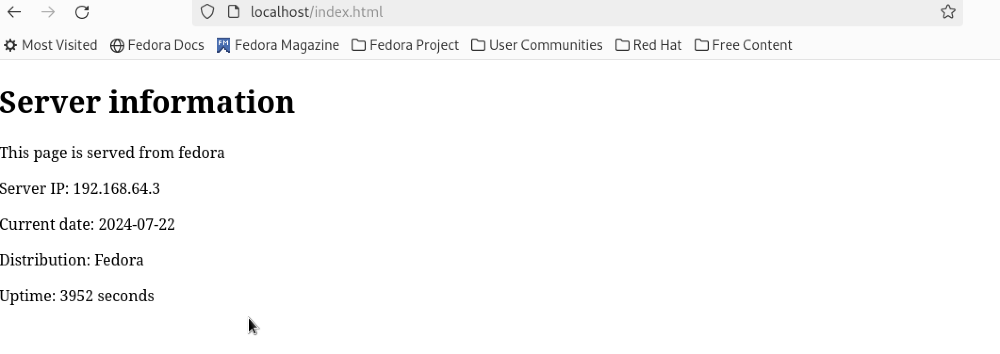

### Deploy Apache Website on Remote Servers using Ansible
Project that includes instructions on adding a user to `NOPASSWD`, running the Ansible playbook, and setting up a new role using `ansible-galaxy` & Deploy Apache server on remote servers.


# Ansible Apache Setup

This project automates the installation and configuration of the Apache web server on different operating systems using Ansible.

## Prerequisites

- Ansible installed on your local machine or cloud Ansible Master node
- SSH access to the target machines - Copy master node public key to remote servers authorized_keys file 
- Properly configured inventory file with your target machines

## Adding a User to NOPASSWD on remote servers Terminal

To allow a user to execute commands without needing to enter a password for `sudo`, you can add them to the `NOPASSWD` list. Run the following command in the terminal:

```sh
echo '<username> ALL=(ALL) NOPASSWD:ALL' | sudo tee /etc/sudoers.d/<remoteusername>

Example : For ubuntu with user ubuntu
echo 'ubuntu ALL=(ALL) NOPASSWD:ALL' | sudo tee /etc/sudoers.d/ubuntu
```

Replace `<username>` with your desired username and `<remoteusername>` with the name of the user on the remote machine.

## Running the Ansible Playbook

To run the Ansible playbook of this project that installs and configures Apache, use the following command:

```sh
ansible-playbook -i apache/tests/inventory app/site.yml
```

Make sure the `inventory` file in the `apache/tests` directory is correctly configured with the details of your target machines IP.

Output looks like 

```
ansible-playbook-roles ansible-playbook -i apache/tests/inventory app/site.yml

PLAY [Install and configure Apache] *************************************************************************************************************************************

TASK [Gathering Facts] **************************************************************************************************************************************************
[WARNING]: Platform linux on host 192.168.64.3 is using the discovered Python interpreter at /usr/bin/python3.11, but future installation of another Python interpreter
could change the meaning of that path. See https://docs.ansible.com/ansible-core/2.17/reference_appendices/interpreter_discovery.html for more information.
ok: [192.168.64.3]

TASK [apache : Determine operating system] ******************************************************************************************************************************
ok: [192.168.64.3]

TASK [apache : Install Apache on macOS] *********************************************************************************************************************************
skipping: [192.168.64.3]

TASK [apache : Install Apache on Fedora] ********************************************************************************************************************************
included: /Users/jimi/ansible-project/ansible-playbook-roles/apache/tasks/install_fedora.yml for 192.168.64.3

TASK [apache : Ensure the httpd package is installed] *******************************************************************************************************************
ok: [192.168.64.3]

TASK [apache : Start the httpd service if needed] ***********************************************************************************************************************
ok: [192.168.64.3]

TASK [apache : Deploy custom index.html] ********************************************************************************************************************************
changed: [192.168.64.3]

TASK [apache : Install Apache on Debian/Ubuntu] *************************************************************************************************************************
skipping: [192.168.64.3]

TASK [apache : Perform a health check on the website] *******************************************************************************************************************
ok: [192.168.64.3]

TASK [apache : Notify if the website is not available] ******************************************************************************************************************
skipping: [192.168.64.3]

RUNNING HANDLER [apache : restart apache] *******************************************************************************************************************************
changed: [192.168.64.3]

PLAY RECAP **************************************************************************************************************************************************************
192.168.64.3               : ok=8    changed=2    unreachable=0    failed=0    skipped=3    rescued=0    ignored=0  
```
## Screenshot



## Setting Up a New Role

To create a new Ansible role, you can use the `ansible-galaxy` command. For this project, the role is named `apache`. Run the following command to initialize a new role:

```sh
ansible-galaxy init apache
```

This command will create the necessary directory structure and files for the `apache` role in your project.

## Project Structure

Here's a brief overview of the project structure:

```
ansible-playbook-roles/
├── apache
│   ├── defaults
│   ├── files
│   ├── handlers
│   ├── meta
│   ├── tasks
│   ├── templates
│   ├── tests
│   └── vars
├── app
│   ├── site.yml
├── README.md
```

## Role and Playbook Details

- **main.yml**: The main task file that determines the operating system and includes appropriate tasks for installing and configuring Apache.
- **install_mac.yml**: Task file for installing Apache on macOS.
- **install_fedora.yml**: Task file for installing Apache on Fedora.
- **install_debian.yml**: Task file for installing Apache on Debian/Ubuntu.
- **verify.yml**: A playbook to verify the installation by performing a health check on the web server.

## Health Check

The playbook performs a health check on the website and notifies if the website is not available.

## Contribution

Feel free to contribute to this project by opening issues or submitting pull requests.

## License

This project is licensed under the MIT License.
```

This `README.md` file should provide clear instructions for setting up, running, and contributing to your Ansible project.
